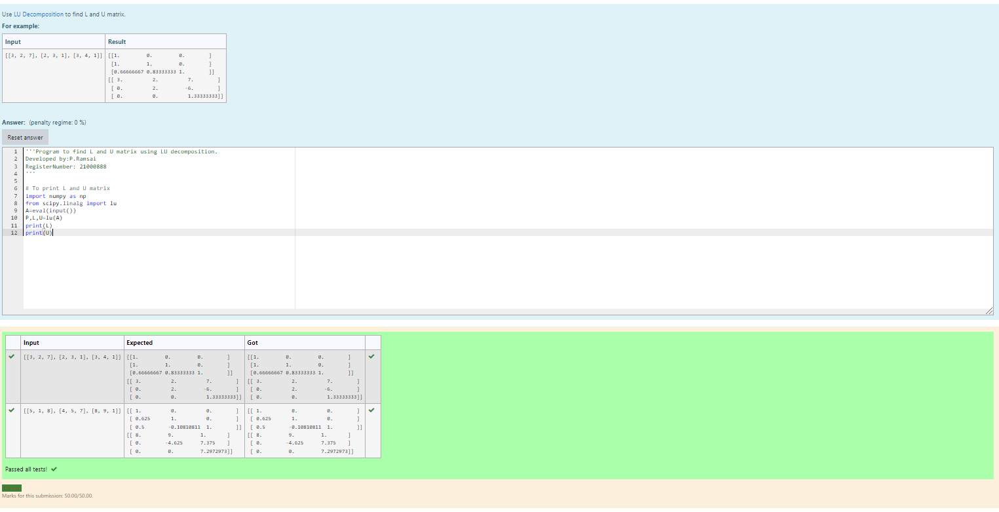
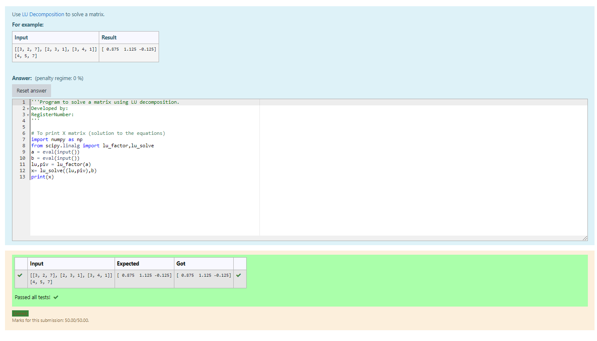

# LU Decomposition without zero on the diagonal

## AIM:
To write a program to find the LU Decomposition of a matrix.

## Equipments Required:
1. Hardware – PCs
2. Anaconda – Python 3.7 Installation / Moodle-Code Runner

## Algorithm
1.import numpy and sciphy.linalg 
2.Take the input of given matrix using eval
3.Caluculate the value using the functions imported
4.Print the requried values 

## Program:
### Program 1
```
/*
Program to find the LU Decomposition of a matrix.
Developed by:P.RAMSAI 
RegisterNumber:21000888 
*/
import numpy as np
from scipy.linalg import lu
A=eval(input())
P,L,U=lu(A)
print(L)
print(U)
```
### Program 2
~~~
/*
Program to find the LU Decomposition of a matrix.
Developed by:P.RAMSAI 
RegisterNumber:21000888 
*/
import numpy as np
from scipy.linalg import lu_factor,lu_solve
a = eval(input())
b = eval(input())
lu,piv = lu_factor(a)
x= lu_solve((lu,piv),b)
print(x)
~~~

## Output:





## Result:
Thus the program to find the LU Decomposition of a matrix is written and verified using python programming.

